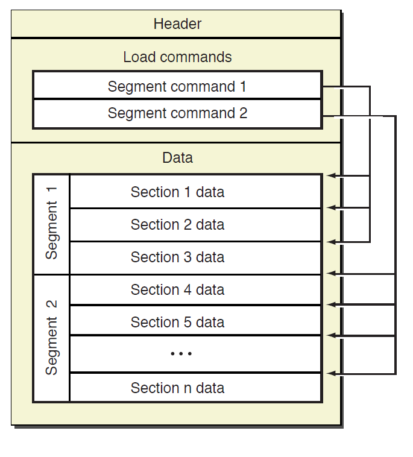

## 基本结构


## 文件头
```C
/* The 32-bit mach header appears at the very beginning of the object file for 32-bit architectures. */
struct mach_header {
    uint32_t magic; /* mach magic number identifier */
    cpu_type_t cputype; /* cpu specifier */
    cpu_subtype_t cpusubtype; /* machine specifier */
    uint32_t filetype /* type of file */
    uint32_t ncmds; /* number of load commands */
    uint32_t sizeofcmds; /* the size of all the load commands */
    uint32_t flags; /* flags */
};
/* Constant for the magic field of the mach_header (32-bit architectures) */
#define MH_MAGIC 0xfeedface /* the mach magic number */
#define MH_CIGAM 0xcefaedfe /* NXSwapInt(MH_MAGIC) */
/* The 64-bit mach header appears at the very beginning of object files for 64-bit architectures. */
struct mach_header_64 {
    uint32_t magic; /* mach magic number identifier */
    cpu_type_t cputype; /* cpu specifier */
    cpu_subtype_t cpusubtype; /* machine specifier */
    uint32_t filetype; /* type of file */
    uint32_t ncmds; /* number of load commands */
    uint32_t sizeofcmds; /* the size of all the load commands */
    uint32_t flags; /* flags */
    uint32_t reserved; /* reserved */
};
/* Constant for the magic field of the mach_header_64 (64-bit architectures) */
#define MH_MAGIC_64 0xfeedfacf /* the 64-bit mach magic number */
#define MH_CIGAM_64 0xcffaedfe /* NXSwapInt(MH_MAGIC_64) */
```
* magic<br>
魔数，系统加载器通过该字段快速判断文件适用于32位还是64位。0xfeedface是32位，0xfeedfacf是64位

* cputype<br>
```
CPU_TYPE_MC680x0
CPU_TYPE_X86
CPU_TYPE_I386
CPU_TYPE_X86_64
CPU_TYPE_MC98000
CPU_TYPE_HPPA
CPU_TYPE_ARM
CPU_TYPE_ARM64
CPU_TYPE_MC88000
CPU_TYPE_SPARC
CPU_TYPE_I860
CPU_TYPE_POWERPC
CPU_TYPE_POWERPC64
```

* cpusubtype<br>
```
//X86 subtypes.
CPU_SUBTYPE_X86_ALL
CPU_SUBTYPE_X86_64_ALL
CPU_SUBTYPE_X86_ARCH1
CPU_SUBTYPE_X86_64_H
//ARM subtypes
CPU_SUBTYPE_ARM_ALL
CPU_SUBTYPE_ARM_V4T
CPU_SUBTYPE_ARM_V6
CPU_SUBTYPE_ARM_V5TEJ
CPU_SUBTYPE_ARM_XSCALE
CPU_SUBTYPE_ARM_V7
CPU_SUBTYPE_ARM_V7F
CPU_SUBTYPE_ARM_V7S
CPU_SUBTYPE_ARM_V7K
CPU_SUBTYPE_ARM_V6M
......
```

* filetype<br>
```
MH_OBJECT
MH_EXECUTE
MH_BUNDLE
MH_BUNDLE
MH_DYLIB
MH_PRELOAD
MH_CORE
MH_DYLINKER
MH_DYSM
......
```

* ncmds<br>
加载命令个数

* sizeofcmds<br>
加载命令占用的总字节数

* flags<br>
标志位，表示二进制文件支持的特性，主要是和系统加载，链接相关
```
MH_NOUNDEFS
MH_INCRLINK
MH_DYLDLINK
MH_TWOLEVEL
MH_BINDATLOAD
MH_PREBOUND
MH_PREBINDABLE
......
```

## 加载命令
```C
struct load_command {
    uint32_t cmd;
    uint32_t cmdsize;
};
```
* cmd<br>
命令类型
```
/* Constants for the cmd field of all load commands, the type */
#define LC_SEGMENT 0x1 /* segment of this file to be mapped */
#define LC_SYMTAB 0x2 /* link-edit stab symbol table info */
#define LC_SYMSEG 0x3 /* link-edit gdb symbol table info (obsolete) */
#define LC_THREAD 0x4 /* thread */
#define LC_UNIXTHREAD 0x5 /* unix thread (includes a stack) */
#define LC_LOADFVMLIB 0x6 /* load a specified fixed VM shared library */
#define LC_IDFVMLIB 0x7 /* fixed VM shared library identification */
#define LC_IDENT 0x8 /* object identification info (obsolete) */
#define LC_FVMFILE 0x9 /* fixed VM file inclusion (internal use) */
#define LC_PREPAGE 0xa /* prepage command (internal use) */
#define LC_DYSYMTAB 0xb /* dynamic link-edit symbol table info */
#define LC_LOAD_DYLIB 0xc /* load a dynamically linked shared library */
#define LC_ID_DYLIB 0xd /* dynamically linked shared lib ident */
#define LC_LOAD_DYLINKER 0xe /* load a dynamic linker */
#define LC_ID_DYLINKER 0xf /* dynamic linker identification */
#define LC_PREBOUND_DYLIB 0x10 /* modules prebound for a dynamically */
/* linked shared library */
#define LC_ROUTINES 0x11 /* image routines */
#define LC_SUB_FRAMEWORK 0x12 /* sub framework */
#define LC_SUB_UMBRELLA 0x13 /* sub umbrella */
#define LC_SUB_CLIENT 0x14 /* sub client */
#define LC_SUB_LIBRARY 0x15 /* sub library */
#define LC_TWOLEVEL_HINTS 0x16 /* two-level namespace lookup hints */
#define LC_PREBIND_CKSUM 0x17 /* prebind checksum */
/* load a dynamically linked shared library that is allowed to be missing (all symbols are weak imported). */
#define LC_LOAD_WEAK_DYLIB (0x18 | LC_REQ_DYLD)
#define LC_SEGMENT_64 0x19 /* 64-bit segment of this file to be mapped */
#define LC_ROUTINES_64 0x1a /* 64-bit image routines */
#define LC_UUID 0x1b /* the uuid */
#define LC_RPATH (0x1c | LC_REQ_DYLD) /* runpath additions */
#define LC_CODE_SIGNATURE 0x1d /* local of code signature */
#define LC_SEGMENT_SPLIT_INFO 0x1e /* local of info to split segments */
#define LC_REEXPORT_DYLIB (0x1f | LC_REQ_DYLD) /* load and re-export dylib */
#define LC_LAZY_LOAD_DYLIB 0x20 /* delay load of dylib until first use */
#define LC_ENCRYPTION_INFO 0x21 /* encrypted segment information */
#define LC_DYLD_INFO 0x22 /* compressed dyld information */
#define LC_DYLD_INFO_ONLY (0x22|LC_REQ_DYLD) /* compressed dyld information only */
#define LC_LOAD_UPWARD_DYLIB (0x23 | LC_REQ_DYLD) /* load upward dylib */
#define LC_VERSION_MIN_MACOSX 0x24 /* build for MacOSX min OS version */
#define LC_VERSION_MIN_IPHONEOS 0x25 /* build for iPhoneOS min OS version */
#define LC_FUNCTION_STARTS 0x26 /* compressed table of function start addresses */
```

* cmdsize<br>
命令结构体的总字节数，每个加载命令前两个字段都一样，不同类型的命令后面字段不一样。
1. LC_UUID
```C
struct uuid_command {
    uint32_t cmd;
    uint32_t cmdsize;
    uint8_t uuid[16];
};
```
128位文件UUID

2. LC_SEGMENT, LC_SEGMENT_64
```C
struct segment_command {
    uint32_t cmd;
    uint32_t cmdsize;
    char segname[16];
    uint32_t vmaddr;
    uint32_t vmsize;
    uint32_t fileoff;
    uint32_t filesize;
    vm_prot_t maxprot;
    vm_prot_t initprot;
    uint32_t nsects;
    uint32_t flags;
};
struct segment_command_64 {
    uint32_t cmd;
    uint32_t cmdsize;
    char segname[16];
    uint64_t vmaddr;
    uint64_t vmsize;
    uint64_t fileoff;
    uint64_t filesize;
    vm_prot_t maxprot;
    vm_prot_t initprot;
    uint32_t nsects;
    uint32_t flags;
};
```
以下字段描述针对64位文件
* cmd<br>
LC_SEGMENT_64
* cmdsize<br>
(sizeof(segment_command_64) + (sizeof(section_64) * segment->nsect)))
* segname<br>
段名称字符串
* vmaddr<br>
加载到内存后的起始地址
* vmsize<br>
加载到内存后的大小
* fileoff<br>
段数据在文件中的偏移
* filesize<br>
段数据在文件中的大小
* maxprot<br>
段的最大权限。段内所有数据权限相同，根据initprot初始化，在运行过程中可以被修改，但是权限不能超过maxprot指定的值(iOS中+w和+x互斥)
* initprot<br>
初始权限
* nsects<br>
紧跟在这个加载命令后面的section_64结构体数量
* flags<br>
标志位: SG_HIGHVM, SG_NORELOC......

3. LC_SYMTAB<br>
```C
struct symtab_command {
    uint_32 cmd;
    uint_32 cmdsize;
    uint_32 symoff;
    uint_32 nsyms;
    uint_32 stroff;
    uint_32 strsize;
};
```
描述符号表数据结构的位置和大小
* cmd<br>
LC_SYMTAB
* cmdsize<br>
sizeof(symtab_command)
* symoff<br>
符号表在文件中的偏移位置
* nsyms<br>
符号表中的条目数量
* stroff<br>
字符串表的偏移位置
* strsize<br>
字符串表的总字节数

## 符号表

## 重定位数据
