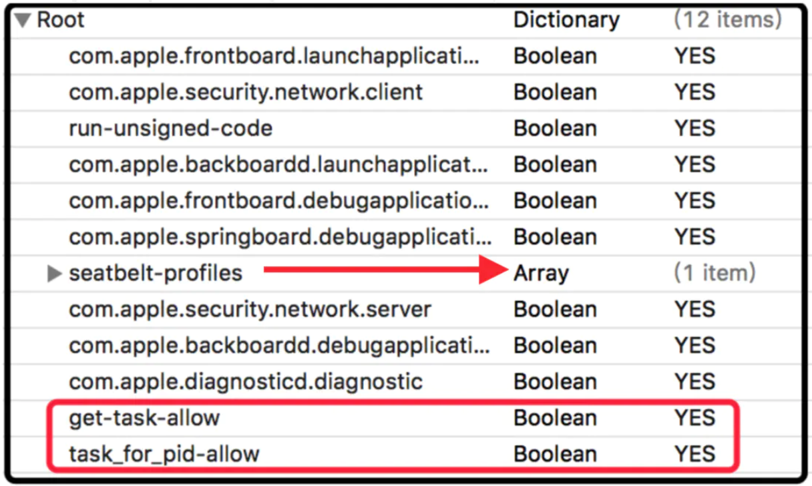

# LLDB

### 安装debugserver
* 启动Xcode，USB连接越狱手机，XCode会自动将debugserver安装到iPhone上/Developer/usr/bin目录
* 默认安装的debugserver缺少权限，只能调试Xcode安装的app，无法调试其他app(比如来自AppStore的app)，需要对debugserver重新签名，添加上两个权限，步骤如下
    1. 复制debugserver到Mac下
    2. 导出文件以前的签名权限
    ```
    $ ldid -e debugserver > debugserver.entitlements
    ```
    3. 为debugserver.entitlements添加权限
    
    4. 重新签名，复制到iPhone上/usr/bin目录
    ```
    $ ldid -Sdebugserver.entitlements debugserver
    ```

### 连接debugserver
1. iPhone端
```
$ debugserver *:port -a pid
```
2. Mac端
```
$ lldb
(lldb) process connect connect://ip:port
```

### 常用命令
* 帮助
    * help
    ```
    //列出所有命令
    (lldb) help

    //显示breakpoint命令相关信息
    (lldb) help breakpoint

    //显示breakpoint name命令相关信息
    (lldb) help breakpoint name
    ```
    * apropos
    ```
    //搜索关键词"breakpoint"相关的文档
    (lldb) apropos breakpoint
    ```
